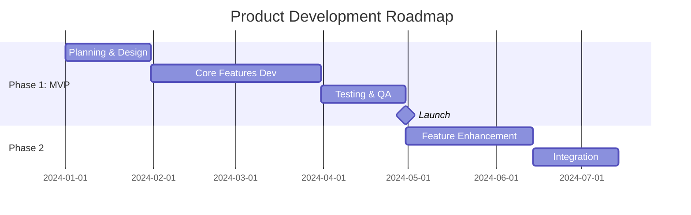

# PRD: [Product/Project Name]

> **Product**: [Name] | **Version**: 1.0 | **Status**: Draft/Review/Approved
> **Created**: [YYYY-MM-DD] | **Updated**: [YYYY-MM-DD]
> **Client/Stakeholder**: [Client Name/Company]

---

## 1. Executive Summary

### 1.1 Product Vision

[High-level vision statement - what problem does this product solve and for whom?]

**Vision Statement**: [One sentence describing the product vision]

### 1.2 Product Goals

| Goal ID | Goal Description | Success Metric | Priority |
|---------|------------------|----------------|----------|
| G-001 | [Primary goal] | [Measurable metric] | High |
| G-002 | [Secondary goal] | [Measurable metric] | Medium |
| G-003 | [Tertiary goal] | [Measurable metric] | Low |

### 1.3 Business Objectives

- **Business Value**: [What business value does this product deliver?]
- **Revenue Model**: [How will this product generate revenue?]
- **Market Opportunity**: [Market size, growth potential]
- **Competitive Advantage**: [What makes this product unique?]

---

## 2. Market & User Analysis

### 2.1 Target Market

| Segment | Description | Size | Characteristics |
|---------|-------------|------|-----------------|
| Primary | [Main target segment] | [Size estimate] | [Key characteristics] |
| Secondary | [Secondary segment] | [Size estimate] | [Key characteristics] |

### 2.2 User Personas

#### Persona 1: [Persona Name]

| Attribute | Description |
|-----------|-------------|
| **Name** | [Persona name] |
| **Role** | [Job title/role] |
| **Demographics** | Age: [X], Location: [Y], Industry: [Z] |
| **Goals** | [What they want to achieve] |
| **Pain Points** | [Current challenges/frustrations] |
| **Technology Comfort** | [Low/Medium/High] |
| **Usage Context** | [When/where/how they would use the product] |

#### Persona 2: [Persona Name]

[Same structure as Persona 1]

### 2.3 Competitive Analysis

| Competitor | Strengths | Weaknesses | Our Differentiation |
|------------|-----------|------------|---------------------|
| [Competitor 1] | [Key strengths] | [Key weaknesses] | [How we're different] |
| [Competitor 2] | [Key strengths] | [Key weaknesses] | [How we're different] |

**Market Positioning**: [Where does this product fit in the market?]

---

## 3. Product Scope

### 3.1 In Scope (MVP)

| Feature ID | Feature Name | Description | Priority | User Story Count |
|------------|--------------|-------------|----------|------------------|
| F-001 | [Core feature] | [Brief description] | Must Have | [X] |
| F-002 | [Core feature] | [Brief description] | Must Have | [X] |
| F-003 | [Important feature] | [Brief description] | Should Have | [X] |

### 3.2 Out of Scope (Future Phases)

| Feature ID | Feature Name | Reason for Exclusion | Future Phase |
|------------|--------------|----------------------|--------------|
| F-101 | [Future feature] | [Why not in MVP] | Phase 2 |
| F-102 | [Future feature] | [Why not in MVP] | Phase 3 |

### 3.3 Assumptions & Constraints

#### Assumptions

| ID | Assumption | Impact if Wrong | Validation Plan |
|----|------------|-----------------|-----------------|
| A-001 | [Assumption about users/market] | [Impact] | [How to validate] |
| A-002 | [Assumption about technology] | [Impact] | [How to validate] |

#### Constraints

| ID | Constraint Type | Description | Impact |
|----|-----------------|-------------|--------|
| C-001 | Technical | [Technical limitation] | [How it affects product] |
| C-002 | Business | [Business limitation] | [How it affects product] |
| C-003 | Timeline | [Time constraint] | [How it affects product] |
| C-004 | Budget | [Budget constraint] | [How it affects product] |

---

## 4. User Stories (High-Level)

> **Note**: Detailed user stories with acceptance criteria will be in FRD documents for each feature.

### 4.1 Epic 1: [Epic Name]

**Epic Description**: [High-level description of the epic]

| Story ID | User Story | Priority | Story Points | Feature |
|----------|------------|----------|--------------|---------|
| US-001 | As [role], I want [action], so that [benefit] | High | [X] | F-001 |
| US-002 | As [role], I want [action], so that [benefit] | High | [X] | F-001 |
| US-003 | As [role], I want [action], so that [benefit] | Medium | [X] | F-002 |

### 4.2 Epic 2: [Epic Name]

[Same structure as Epic 1]

---

## 5. Success Metrics & KPIs

### 5.1 Product Metrics

| Metric ID | Metric Name | Target | Measurement Method | Frequency |
|-----------|-------------|--------|-------------------|-----------|
| M-001 | User Acquisition | [Target number] | [Analytics tool] | Monthly |
| M-002 | User Engagement | [Target %] | [Analytics tool] | Weekly |
| M-003 | Feature Adoption | [Target %] | [Analytics tool] | Monthly |
| M-004 | User Satisfaction | [Target score] | [Survey/NPS] | Quarterly |

### 5.2 Business Metrics

| Metric ID | Metric Name | Target | Measurement Method | Frequency |
|-----------|-------------|--------|-------------------|-----------|
| BM-001 | Revenue | [Target amount] | [Financial system] | Monthly |
| BM-002 | Customer Acquisition Cost | [Target amount] | [Financial system] | Monthly |
| BM-003 | Customer Lifetime Value | [Target amount] | [Financial system] | Quarterly |

### 5.3 Technical Metrics

| Metric ID | Metric Name | Target | Measurement Method | Frequency |
|-----------|-------------|--------|-------------------|-----------|
| TM-001 | System Uptime | [Target %] | [Monitoring tool] | Daily |
| TM-002 | Response Time | [Target ms] | [Monitoring tool] | Daily |
| TM-003 | Error Rate | [Target %] | [Monitoring tool] | Daily |

---

## 6. Product Roadmap

### 6.1 Timeline Overview

### 6.2 Phase Details

#### Phase 1: MVP (Minimum Viable Product)

| Milestone | Target Date | Deliverables | Success Criteria |
|-----------|-------------|--------------|------------------|
| M1: Planning Complete | [Date] | PRD, FRDs, TDDs | All documents approved |
| M2: Core Features Complete | [Date] | [Feature list] | All MVP features functional |
| M3: Testing Complete | [Date] | Test reports | All tests passing |
| M4: Launch | [Date] | Production release | Product live and accessible |

#### Phase 2: Enhancement

[Same structure as Phase 1]

#### Phase 3: Scale

[Same structure as Phase 1]

---

## 7. Risk Assessment

| Risk ID | Risk Description | Probability | Impact | Mitigation Strategy | Owner |
|---------|------------------|-------------|--------|---------------------|-------|
| R-001 | [Technical risk] | High/Medium/Low | High/Medium/Low | [How to mitigate] | [Owner] |
| R-002 | [Market risk] | High/Medium/Low | High/Medium/Low | [How to mitigate] | [Owner] |
| R-003 | [Resource risk] | High/Medium/Low | High/Medium/Low | [How to mitigate] | [Owner] |

---

## 8. Stakeholders & Team

### 8.1 Stakeholders

| Role | Name/Organization | Responsibility | Contact |
|------|-------------------|----------------|---------|
| Product Owner | [Name] | [Responsibilities] | [Contact] |
| Client Representative | [Name] | [Responsibilities] | [Contact] |
| Technical Lead | [Name] | [Responsibilities] | [Contact] |

### 8.2 Development Team

| Role | Count | Responsibilities |
|------|-------|------------------|
| Project Manager | [X] | [Responsibilities] |
| Backend Developer | [X] | [Responsibilities] |
| Frontend Developer | [X] | [Responsibilities] |
| QA Engineer | [X] | [Responsibilities] |
| Designer | [X] | [Responsibilities] |

---

## 9. Dependencies & Integrations

### 9.1 External Dependencies

| Dependency ID | Dependency Name | Type | Impact if Delayed | Owner |
|---------------|-----------------|------|-------------------|-------|
| D-001 | [Third-party service] | External API | [Impact] | [Owner] |
| D-002 | [Infrastructure] | Infrastructure | [Impact] | [Owner] |

### 9.2 Internal Dependencies

| Dependency ID | Dependency Name | Type | Impact if Delayed | Owner |
|---------------|-----------------|------|-------------------|-------|
| D-101 | [Internal system] | System | [Impact] | [Owner] |
| D-102 | [Team/Resource] | Resource | [Impact] | [Owner] |

### 9.3 Integrations Required

| Integration ID | System/Service | Purpose | Priority | Status |
|----------------|----------------|---------|----------|--------|
| I-001 | [System name] | [Purpose] | High | Planned |
| I-002 | [System name] | [Purpose] | Medium | Planned |

---

## 10. Compliance & Legal

### 10.1 Regulatory Requirements

| Requirement ID | Requirement | Applicable Region | Compliance Status |
|----------------|-------------|-------------------|-------------------|
| REG-001 | [Regulation name] | [Region] | [Status] |
| REG-002 | [Regulation name] | [Region] | [Status] |

### 10.2 Data Privacy & Security

- **Data Protection**: [GDPR, CCPA, etc.]
- **Data Storage**: [Where data is stored]
- **Data Retention**: [How long data is kept]
- **Security Standards**: [ISO 27001, SOC 2, etc.]

---

## 11. Appendices

### 11.1 Glossary

| Term | Definition |
|------|------------|
| [Term 1] | [Definition] |
| [Term 2] | [Definition] |

### 11.2 References

| Type | Path/Link |
|------|-----------|
| Market Research | [Link] |
| Competitive Analysis | [Link] |
| Technical Documentation | `docs/technical/` |
| Feature Documentation | `docs/features/` |

### 11.3 Related Documents

- [Link to Business Plan]
- [Link to Technical Architecture]
- [Link to Design System]

---

## Version History

| Version | Date | Author | Changes |
|---------|------|--------|---------|
| 1.0 | [YYYY-MM-DD] | [Name/AI] | Initial version |
| 1.1 | [YYYY-MM-DD] | [Name/AI] | [Changes made] |

