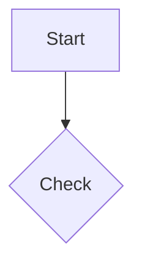
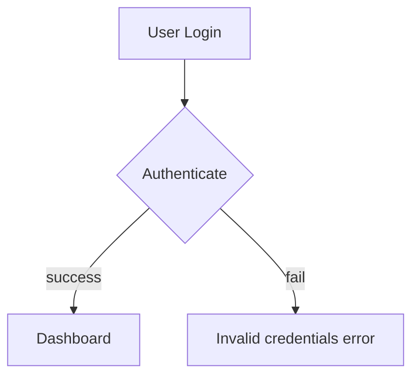

# Mermaid Fix Workflow

Automatically detect and repair syntax errors in Mermaid flowchart diagrams.

## 🎯 Purpose

This workflow helps you fix broken Mermaid diagrams by:
- Detecting syntax errors in node definitions
- Fixing arrow label formatting issues
- Correcting special characters in node text
- Ensuring proper flowchart structure
- Providing detailed explanations of all fixes

## 📋 When to Use

Use this workflow when:
- Your Mermaid diagram fails to render
- You see syntax errors in Mermaid preview
- You want to validate Mermaid syntax before committing
- You need to clean up auto-generated Mermaid code

## 🔄 Workflow Steps

### Step 1: Identify Mermaid Code

**Ask user for the Mermaid code in one of these ways:**

1. **Direct paste**: User pastes the Mermaid code
2. **File path**: User provides path to a file containing Mermaid code
3. **Current conversation**: Extract Mermaid code blocks from recent messages

Example prompts:
```
Please provide:
1. Paste your Mermaid code directly
2. Provide file path (e.g., docs/architecture.md)
3. Say "fix the diagram above" if already in conversation
```

### Step 2: Extract Mermaid Code

**If file path provided:**
```bash
# Read the file
cat path/to/file.md
```

Extract code between triple backticks with `mermaid` language tag:
````markdown

````

**If direct paste:**
- Use the provided code as-is
- Strip surrounding markdown if present

**If from conversation:**
- Scan previous messages for ```mermaid blocks
- Confirm with user which diagram to fix

### Step 3: Analyze Current State

Display the original Mermaid code:

```
📊 Original Mermaid Diagram:
---
[Show the code with line numbers]
---
```

### Step 4: Call MCP Tool

Use the `mermaid_fix` MCP tool:

```javascript
{
  "tool": "mermaid_fix",
  "input": {
    "mermaid_code": "graph TD\n  A[Get(id)] --> B{Check: x==1}"
  }
}
```

The tool returns JSON:
```json
{
  "fixed_code": "graph TD\n  A[Get ID] --> B{Check value}\n  B -- \"yes\" --> C[Continue]",
  "explanation": "Fixed node text with special characters and added quotes to arrow labels",
  "changes": [
    {
      "type": "Node Text",
      "original": "A[Get(id)]",
      "fixed": "A[Get ID]",
      "reason": "Removed parentheses from node text (invalid syntax)"
    },
    {
      "type": "Arrow Label",
      "original": "B -- yes --> C",
      "fixed": "B -- \"yes\" --> C",
      "reason": "Added quotes around arrow label for consistency"
    }
  ]
}
```

### Step 5: Present Results

Display results in a clear, structured format:

```
✅ Mermaid Fix Complete!

📝 Summary:
- Fixed 3 syntax errors
- Cleaned 2 node definitions
- Standardized 1 arrow label

🔧 Changes Made:

1. Node Text Issue
   Original: A[Get data(get_id)]
   Fixed:    A[Get data]
   Reason:   Removed parentheses (invalid in node text)

2. Arrow Label Issue
   Original: B -- yes --> C
   Fixed:    B -- "yes" --> C
   Reason:   Added quotes for non-English label

3. Structural Issue
   Original: D{Verify: status == 200}
   Fixed:    D{Verify response status}
   Reason:   Removed special characters from decision box

📋 Fixed Code:
---
[Display the complete fixed code in a code block]
---

💡 Explanation:
[Show the explanation from the tool]
```

### Step 6: Offer Next Actions

Ask user what to do next:

```
What would you like to do?

1. Copy fixed code to clipboard
2. Save to file (overwrite original)
3. Save to new file
4. Show side-by-side comparison
5. Done
```

**Option 1: Copy to clipboard**
- Display: "✅ Fixed code ready to paste!"

**Option 2: Overwrite original**
```bash
# If original was from file
cat > path/to/file.md << 'EOF'
[Fixed Mermaid code]
EOF
```
- Confirm: "✅ File updated: path/to/file.md"

**Option 3: Save to new file**
- Ask for filename
- Save with `-fixed` suffix if not provided
- Confirm: "✅ Saved to: path/to/file-fixed.md"

**Option 4: Side-by-side comparison**
```
Original                          →  Fixed
--------------------------------  →  --------------------------------
graph TD                          →  graph TD
  A[Get(id)] --> B                →    A[Get ID] --> B
  B{Check: x==1}                  →    B{Check value}
  B -- yes --> C                  →    B -- "yes" --> C
```

## 🔍 Common Mermaid Errors Fixed

### 1. Node Text with Special Characters
```mermaid
# ❌ ERROR
A[Get data(id, name)]

# ✅ FIXED
A[Get data by ID and name]
```

### 2. Arrow Labels without Quotes
```mermaid
# ❌ ERROR
A -- cache hit --> B

# ✅ FIXED
A -- "cache hit" --> B
```

### 3. Decision Box with Symbols
```mermaid
# ❌ ERROR
B{Verify: status == 200}

# ✅ FIXED
B{Verify status code}
```

### 4. Invalid Node IDs
```mermaid
# ❌ ERROR
123Start[Begin]

# ✅ FIXED
start123[Begin]
```

## 📊 Example Usage

**User:** `/mermaid-fix`

**Agent:**
```
Please provide your Mermaid code:
1. Paste directly
2. Provide file path
3. Say "fix above" if already shared
```

**User:** *pastes code*
```mermaid
graph TD
  A[User: Login(email, pass)] --> B{Auth: check}
  B -- success --> C[Dashboard]
  B -- fail --> D[Error: Invalid]
```

**Agent:**
```
✅ Mermaid Fix Complete!

🔧 Changes Made:

1. Node Text Issue (Line 2)
   Original: A[User: Login(email, pass)]
   Fixed:    A[User Login]
   Reason:   Removed special characters from node text

2. Node Text Issue (Line 3)
   Original: B{Auth: check}
   Fixed:    B{Authenticate}
   Reason:   Removed colon from decision box

3. Arrow Label Issue (Line 4)
   Original: B -- success --> C
   Fixed:    B -- "success" --> C
   Reason:   Added quotes for consistency

4. Node Text Issue (Line 5)
   Original: D[Error: Invalid]
   Fixed:    D[Invalid credentials error]
   Reason:   Removed colon from node text

📋 Fixed Code:


What would you like to do?
1. Copy fixed code
2. Save to file
3. Show comparison
4. Done
```

## ⚙️ Advanced Options

### Batch Fix Multiple Diagrams

If user provides a file with multiple Mermaid blocks:

1. Extract all ```mermaid blocks
2. Fix each one individually
3. Report summary: "Fixed 3 of 4 diagrams (1 already valid)"
4. Offer to save all fixes

### Validation Mode

Add a `--validate` flag:
- Only check for errors
- Don't apply fixes
- Report what would be fixed

Example:
```
🔍 Validation Results:
- 3 syntax errors found
- 0 structural issues
- 2 style improvements possible

Run without --validate to apply fixes.
```

## 🚨 Error Handling

### If MCP Tool Fails
```
❌ Error: Could not connect to Mermaid Fix service

Please check:
1. MCP server is running
2. JAI1_ACCESS_KEY is configured
3. Network connection is available

Or try manual fix:
[Show common fix patterns]
```

### If Code is Valid
```
✅ No errors found!

Your Mermaid diagram syntax is already correct.
No changes needed.
```

### If Code is Not Mermaid
```
⚠️  This doesn't appear to be Mermaid code.

Expected format:


Please provide valid Mermaid flowchart code.
```
