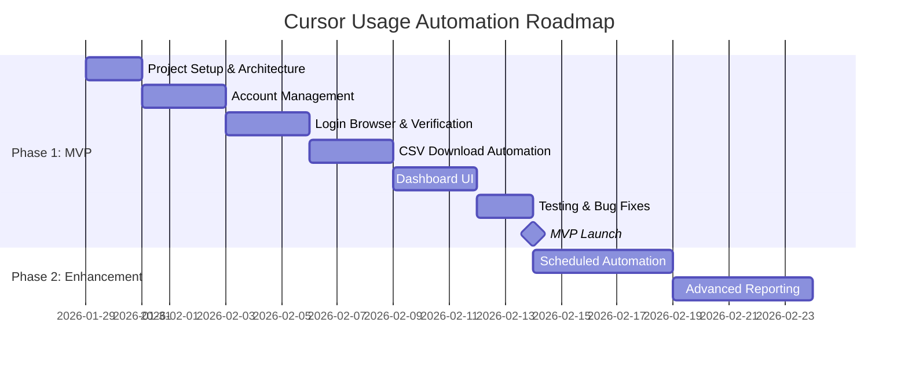

# PRD: Cursor Usage Automation

> **Product**: Cursor Usage Automation | **Version**: 1.0 | **Status**: Draft
> **Created**: 2026-01-29 | **Updated**: 2026-01-29
> **Client/Stakeholder**: Internal Tool

---

## 1. Executive Summary

### 1.1 Product Vision

Hệ thống tự động hóa việc truy cập trang Usage của Cursor để tải file CSV thống kê sử dụng cho nhiều tài khoản. Giải quyết vấn đề quản lý và theo dõi usage của nhiều tài khoản Cursor một cách hiệu quả, tự động và đáng tin cậy.

**Vision Statement**: Xây dựng công cụ automation đáng tin cậy để tự động tải CSV usage từ Cursor cho nhiều tài khoản, sử dụng persistent browser profile thay vì cookie injection.

### 1.2 Product Goals

| Goal ID | Goal Description | Success Metric | Priority |
|---------|------------------|----------------|----------|
| G-001 | Tự động tải CSV usage từ Cursor cho nhiều tài khoản | 100% tài khoản LOGGED_IN có thể tải CSV thành công | High |
| G-002 | Quản lý trạng thái đăng nhập của từng tài khoản | Phát hiện và báo SESSION_EXPIRED trong vòng 1 phút | High |
| G-003 | Cung cấp UI để theo dõi và trigger automation | UI responsive, hiển thị trạng thái real-time | Medium |
| G-004 | Đảm bảo bảo mật - không lưu trữ/expose cookies | Zero cookie leakage | High |

### 1.3 Business Objectives

- **Business Value**: Tiết kiệm thời gian quản lý nhiều tài khoản Cursor, tự động hóa việc thu thập dữ liệu usage
- **Revenue Model**: Internal tool - không có revenue trực tiếp
- **Market Opportunity**: Phục vụ nhu cầu quản lý nhiều tài khoản Cursor trong tổ chức
- **Competitive Advantage**: Sử dụng persistent browser profile thay vì cookie injection - ổn định và bảo mật hơn

---

## 2. Market & User Analysis

### 2.1 Target Market

| Segment | Description | Size | Characteristics |
|---------|-------------|------|-----------------|
| Primary | Quản trị viên quản lý nhiều tài khoản Cursor | Internal | Cần theo dõi usage, billing của nhiều tài khoản |
| Secondary | Team lead/Manager | Internal | Cần báo cáo tổng hợp usage của team |

### 2.2 User Personas

#### Persona 1: Admin - Quản trị viên tài khoản

| Attribute | Description |
|-----------|-------------|
| **Name** | Admin User |
| **Role** | System Administrator |
| **Demographics** | Technical background, quen thuộc với automation tools |
| **Goals** | Tự động hóa việc thu thập usage data, giảm công việc thủ công |
| **Pain Points** | Phải đăng nhập từng tài khoản để tải CSV, cookie bị revoke thường xuyên |
| **Technology Comfort** | High |
| **Usage Context** | Chạy automation hàng ngày/tuần để thu thập dữ liệu |

### 2.3 Competitive Analysis

| Competitor | Strengths | Weaknesses | Our Differentiation |
|------------|-----------|------------|---------------------|
| Manual process | Đơn giản, không cần setup | Tốn thời gian, dễ sai sót | Tự động hóa hoàn toàn |
| Cookie-based automation | Nhanh setup | Cookie bị revoke, không ổn định | Persistent profile - ổn định hơn |

**Market Positioning**: Giải pháp automation đáng tin cậy sử dụng persistent browser profile

---

## 3. Product Scope

### 3.1 In Scope (MVP)

| Feature ID | Feature Name | Description | Priority | User Story Count |
|------------|--------------|-------------|----------|------------------|
| F-001 | Account Management | Thêm/xóa/quản lý tài khoản với persistent browser profile | Must Have | 4 |
| F-002 | Login Browser | Mở browser để user đăng nhập thủ công | Must Have | 2 |
| F-003 | Login Verification | Kiểm tra trạng thái đăng nhập của tài khoản | Must Have | 2 |
| F-004 | CSV Download Automation | Tự động tải CSV từ trang Usage | Must Have | 3 |
| F-005 | Status Dashboard | UI hiển thị trạng thái các tài khoản | Must Have | 3 |
| F-006 | Batch Execution | Chạy automation cho tất cả tài khoản LOGGED_IN | Should Have | 2 |

### 3.2 Out of Scope (Future Phases)

| Feature ID | Feature Name | Reason for Exclusion | Future Phase |
|------------|--------------|----------------------|--------------|
| F-101 | Auto Login | Yêu cầu bảo mật - không tự động đăng nhập | Out of scope |
| F-102 | Cookie Injection | Không ổn định, bị revoke | Out of scope |
| F-103 | Headless Login | Không hỗ trợ theo yêu cầu | Out of scope |
| F-104 | Multi-machine Profile Sharing | Phức tạp, bảo mật | Phase 2 |
| F-105 | Scheduled Automation | Chạy tự động theo lịch | Phase 2 |

### 3.3 Assumptions & Constraints

#### Assumptions

| ID | Assumption | Impact if Wrong | Validation Plan |
|----|------------|-----------------|-----------------|
| A-001 | Cursor không thay đổi UI/selectors thường xuyên | Cần update selectors | Monitor và cấu trúc code dễ update |
| A-002 | Persistent browser profile giữ session lâu dài | Cần re-login thường xuyên hơn | Test với nhiều tài khoản |
| A-003 | User có thể đăng nhập thủ công khi cần | Không thể tự động hóa hoàn toàn | Cung cấp UI rõ ràng |

#### Constraints

| ID | Constraint Type | Description | Impact |
|----|-----------------|-------------|--------|
| C-001 | Technical | Không sử dụng cookie injection | Phải dùng persistent profile |
| C-002 | Technical | Không tự động đăng nhập | User phải đăng nhập thủ công |
| C-003 | Technical | Một profile = một tài khoản | Không thể share profile |
| C-004 | Technical | Không chạy concurrent cùng profile | Sequential execution |
| C-005 | Security | Không log/expose cookies | Giới hạn debugging |

---

## 4. User Stories (High-Level)

> **Note**: Detailed user stories với acceptance criteria sẽ trong FRD documents cho từng feature.

### 4.1 Epic 1: Account Management

**Epic Description**: Quản lý tài khoản Cursor với persistent browser profile

| Story ID | User Story | Priority | Story Points | Feature |
|----------|------------|----------|--------------|---------|
| US-001 | As admin, I want to add a new account, so that I can manage multiple Cursor accounts | High | 3 | F-001 |
| US-002 | As admin, I want to view all accounts and their status, so that I can monitor account health | High | 2 | F-001 |
| US-003 | As admin, I want to remove an account, so that I can clean up unused accounts | Medium | 2 | F-001 |
| US-004 | As admin, I want to see account details, so that I can troubleshoot issues | Medium | 2 | F-001 |

### 4.2 Epic 2: Authentication Flow

**Epic Description**: Đăng nhập và xác thực tài khoản

| Story ID | User Story | Priority | Story Points | Feature |
|----------|------------|----------|--------------|---------|
| US-005 | As admin, I want to open login browser for an account, so that I can login manually | High | 3 | F-002 |
| US-006 | As admin, I want to verify login status, so that I know if session is valid | High | 2 | F-003 |
| US-007 | As admin, I want to be notified when session expires, so that I can re-login | High | 2 | F-003 |

### 4.3 Epic 3: CSV Download Automation

**Epic Description**: Tự động tải CSV từ trang Usage

| Story ID | User Story | Priority | Story Points | Feature |
|----------|------------|----------|--------------|---------|
| US-008 | As admin, I want to download CSV for a single account, so that I can get usage data | High | 3 | F-004 |
| US-009 | As admin, I want to download CSV for all logged-in accounts, so that I can batch process | High | 3 | F-006 |
| US-010 | As admin, I want CSV files named by email, so that I can identify them easily | Medium | 1 | F-004 |

### 4.4 Epic 4: Dashboard & Monitoring

**Epic Description**: UI để theo dõi và trigger automation

| Story ID | User Story | Priority | Story Points | Feature |
|----------|------------|----------|--------------|---------|
| US-011 | As admin, I want to see all accounts in a dashboard, so that I can monitor status | High | 3 | F-005 |
| US-012 | As admin, I want to trigger actions from UI, so that I can control automation | High | 2 | F-005 |
| US-013 | As admin, I want to see last run time and errors, so that I can troubleshoot | Medium | 2 | F-005 |

---

## 5. Success Metrics & KPIs

### 5.1 Product Metrics

| Metric ID | Metric Name | Target | Measurement Method | Frequency |
|-----------|-------------|--------|-------------------|-----------|
| M-001 | CSV Download Success Rate | ≥ 95% | Logs/Status tracking | Per run |
| M-002 | Session Validity Duration | ≥ 7 days | Track session expiry | Weekly |
| M-003 | Automation Execution Time | < 2 min/account | Timing logs | Per run |
| M-004 | Error Detection Rate | 100% | Error handling coverage | Per run |

### 5.2 Business Metrics

| Metric ID | Metric Name | Target | Measurement Method | Frequency |
|-----------|-------------|--------|-------------------|-----------|
| BM-001 | Time Saved per Week | ≥ 2 hours | Manual vs automated comparison | Weekly |
| BM-002 | Accounts Managed | ≥ 10 accounts | Account count | Monthly |

### 5.3 Technical Metrics

| Metric ID | Metric Name | Target | Measurement Method | Frequency |
|-----------|-------------|--------|-------------------|-----------|
| TM-001 | System Stability | Zero crashes | Error logs | Daily |
| TM-002 | Profile Storage Size | < 500MB/profile | Disk usage | Monthly |
| TM-003 | Memory Usage | < 1GB during execution | System monitoring | Per run |

---

## 6. Product Roadmap

### 6.1 Timeline Overview



### 6.2 Phase Details

#### Phase 1: MVP (Minimum Viable Product)

| Milestone | Target Date | Deliverables | Success Criteria |
|-----------|-------------|--------------|------------------|
| M1: Project Setup | 2026-01-31 | Folder structure, dependencies | Project runs |
| M2: Account Management | 2026-02-03 | Add/remove/list accounts | CRUD operations work |
| M3: Auth Flow | 2026-02-06 | Login browser, verification | Can login and verify |
| M4: Automation | 2026-02-09 | CSV download automation | CSV downloaded successfully |
| M5: Dashboard | 2026-02-12 | UI for monitoring/control | UI functional |
| M6: MVP Launch | 2026-02-14 | Complete MVP | All features working |

#### Phase 2: Enhancement (Future)

| Milestone | Target Date | Deliverables | Success Criteria |
|-----------|-------------|--------------|------------------|
| M7: Scheduled Automation | TBD | Cron-like scheduling | Auto-run on schedule |
| M8: Advanced Reporting | TBD | Usage analytics, charts | Reports generated |

---

## 7. Risk Assessment

| Risk ID | Risk Description | Probability | Impact | Mitigation Strategy | Owner |
|---------|------------------|-------------|--------|---------------------|-------|
| R-001 | Cursor thay đổi UI/selectors | Medium | High | Cấu trúc code dễ update selectors, monitor changes | Dev Team |
| R-002 | Session bị revoke thường xuyên | Medium | Medium | Detect và notify user để re-login | Dev Team |
| R-003 | Browser profile bị corrupt | Low | High | Backup profile, recreate mechanism | Dev Team |
| R-004 | Cursor block automation | Low | High | Sử dụng real browser, human-like delays | Dev Team |
| R-005 | Storage space cho profiles | Low | Medium | Monitor disk usage, cleanup old profiles | Admin |

---

## 8. Stakeholders & Team

### 8.1 Stakeholders

| Role | Name/Organization | Responsibility | Contact |
|------|-------------------|----------------|---------|
| Product Owner | Internal | Define requirements, prioritize features | - |
| End User | Admin | Use the tool, provide feedback | - |
| Technical Lead | Developer | Architecture, implementation | - |

### 8.2 Development Team

| Role | Count | Responsibilities |
|------|-------|------------------|
| Full-stack Developer | 1 | Backend automation, Frontend UI |
| QA (Self-testing) | 1 | Testing, bug verification |

---

## 9. Dependencies & Integrations

### 9.1 External Dependencies

| Dependency ID | Dependency Name | Type | Impact if Delayed | Owner |
|---------------|-----------------|------|-------------------|-------|
| D-001 | Playwright | NPM Package | Cannot run automation | Dev Team |
| D-002 | Cursor Website | External Service | Cannot access usage page | Cursor |
| D-003 | Node.js Runtime | Runtime | Cannot run application | Dev Team |

### 9.2 Internal Dependencies

| Dependency ID | Dependency Name | Type | Impact if Delayed | Owner |
|---------------|-----------------|------|-------------------|-------|
| D-101 | accounts.json | Data Store | Cannot manage accounts | Dev Team |
| D-102 | profiles/ directory | Storage | Cannot persist sessions | Dev Team |

### 9.3 Integrations Required

| Integration ID | System/Service | Purpose | Priority | Status |
|----------------|----------------|---------|----------|--------|
| I-001 | Cursor Website | Access usage page, download CSV | High | Planned |
| I-002 | File System | Store profiles, downloaded CSVs | High | Planned |

---

## 10. Compliance & Legal

### 10.1 Regulatory Requirements

| Requirement ID | Requirement | Applicable Region | Compliance Status |
|----------------|-------------|-------------------|-------------------|
| REG-001 | Cursor Terms of Service | Global | Review required |

### 10.2 Data Privacy & Security

- **Data Protection**: Browser profiles chứa session data - KHÔNG được commit hoặc share
- **Data Storage**: Local only - profiles/ và download/ directories
- **Data Retention**: User tự quản lý, có thể xóa profiles khi không cần
- **Security Standards**: 
  - Không log/serialize/expose cookies
  - profiles/ và download/ trong .gitignore
  - Không upload profiles lên bất kỳ đâu

---

## 11. Appendices

### 11.1 Glossary

| Term | Definition |
|------|------------|
| Persistent Browser Profile | Thư mục chứa toàn bộ data của browser session, bao gồm cookies, localStorage |
| WorkOS JWT | Token xác thực của Cursor, session-based và có thể bị revoke |
| Playwright | Thư viện automation browser của Microsoft |
| CSV | Comma-Separated Values - định dạng file export từ Cursor Usage |

### 11.2 References

| Type | Path/Link |
|------|-----------|
| Cursor Usage Page | https://cursor.com/usage |
| Playwright Documentation | https://playwright.dev/docs/intro |
| Technical Documentation | `docs/technical/` |

### 11.3 Folder Structure

```
project/
 ├─ accounts.json          # Account data (id, email, profilePath, status, etc.)
 ├─ run.js                 # Main automation script
 ├─ profiles/              # Browser profiles (local only, never committed)
 │   ├─ acc01/
 │   ├─ acc02/
 │   └─ acc03/
 ├─ download/              # Downloaded CSV files
 ├─ .gitignore             # Ignore profiles/ and download/
 └─ docs/                  # Documentation
```

### 11.4 Account Model

```json
{
  "id": "string",
  "email": "string",
  "profilePath": "string",
  "status": "NOT_LOGGED_IN | LOGGED_IN | SESSION_EXPIRED",
  "lastRunAt": "ISO datetime | null",
  "lastError": "string | null"
}
```

---

## Version History

| Version | Date | Author | Changes |
|---------|------|--------|---------|
| 1.0 | 2026-01-29 | AI Assistant | Initial version - PRD for Cursor Usage Automation |
