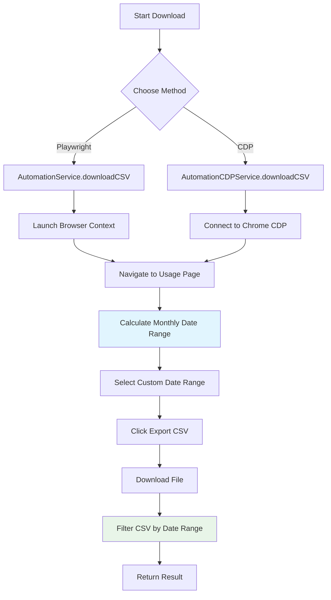

# FRD: CSV Download Automation Enhancement

> **Feature**: CSV Download Automation Enhancement | **Priority**: High | **Status**: Draft
> **Version**: 2.0 | **Updated**: 2026-02-06

---

## 1. Tổng quan (Overview) [REQUIRED]

| Item | Mô tả |
|------|-------|
| **Mục đích (Purpose)** | Nâng cấp hệ thống tự động download CSV với tính năng lọc dữ liệu theo tháng và hỗ trợ Chrome DevTools Protocol (CDP) |
| **Phạm vi (Scope)** | Bao gồm: Monthly date filtering, CDP integration, Enhanced calendar navigation \| Không bao gồm: UI changes, Manual download features |
| **Người dùng (Users)** | System Admin, Automation Users |
| **Dependencies** | Chrome browser với --remote-debugging-port=9222, Playwright, CDP Service |

---

## 2. User Stories [REQUIRED]

### [ADDED] US-001: Monthly Date Range Filtering

**As** system admin, **I want** CSV data to be automatically filtered to only include records from the previous month, **so that** I get relevant monthly reports without manual filtering.

**Acceptance Criteria**:
- [ ] AC-001: Given current date is 2026-02-06, when downloading CSV, then data should include records from 2026-01-01 to 2026-02-01 (exclusive)
- [ ] AC-002: Given CSV contains 1000 records spanning 3 months, when filtering is applied, then only records within the monthly range are kept
- [ ] AC-003: Given filtering completes, when checking logs, then original count and filtered count are reported

| Attribute | Value |
|-----------|-------|
| Priority | High |

### [ADDED] US-002: CDP Alternative Download Method

**As** system admin, **I want** an alternative download method using Chrome DevTools Protocol, **so that** I have a backup option when Playwright fails.

**Acceptance Criteria**:
- [ ] AC-004: Given Chrome is running with CDP enabled, when using AutomationCDPService, then CSV download should work without launching new browser instances
- [ ] AC-005: Given CDP connection fails, when attempting download, then clear error message should be returned
- [ ] AC-006: Given CDP method is used, when download completes, then same filtering logic should be applied

| Attribute | Value |
|-----------|-------|
| Priority | Medium |

### [ADDED] US-003: Enhanced Calendar Navigation

**As** system user, **I want** improved calendar date selection, **so that** custom date ranges are selected accurately and reliably.

**Acceptance Criteria**:
- [ ] AC-007: Given calendar picker is opened, when navigating to target month, then correct month and year should be selected
- [ ] AC-008: Given target day is 1, when selecting day, then only day "1" should be clicked (not "10", "11", "12")
- [ ] AC-009: Given calendar navigation fails, when continuing download, then default date range should be used with warning logged

| Attribute | Value |
|-----------|-------|
| Priority | Medium |

---

## 3. Business Rules [CONDITIONAL]

| ID | Rule Name | Description | Exception |
|----|-----------|-------------|-----------|
| BR-001 | Monthly Range Calculation | Date range always calculated as [first day of previous month, first day of current month) | None |
| BR-002 | CSV Date Format | CSV records must have date in first column with ISO format "YYYY-MM-DDTHH:mm:ss.sssZ" | Skip records with invalid date format |
| BR-003 | CDP Fallback | CDP method only used when explicitly requested or Playwright fails | None |

---

## 4. Non-Functional Requirements [CONDITIONAL]

| ID | Category | Requirement | Metric | Priority |
|----|----------|-------------|--------|----------|
| NFR-001 | Performance | CSV filtering should complete within reasonable time | < 30 seconds for files up to 100MB | Medium |
| NFR-002 | Reliability | Download success rate should be maintained | > 95% success rate | High |
| NFR-003 | Error Handling | All error scenarios should be logged with clear messages | 100% error scenarios logged | High |

---

## 5. Process Flow [CONDITIONAL]

---

## References

| Type | Path/Link |
|------|-----------|
| TDD | `docs/features/csv-download-automation/TDD-csv-download-automation.md` |
| Test Scenarios | `docs/features/csv-download-automation/TEST-csv-download-automation.md` |
