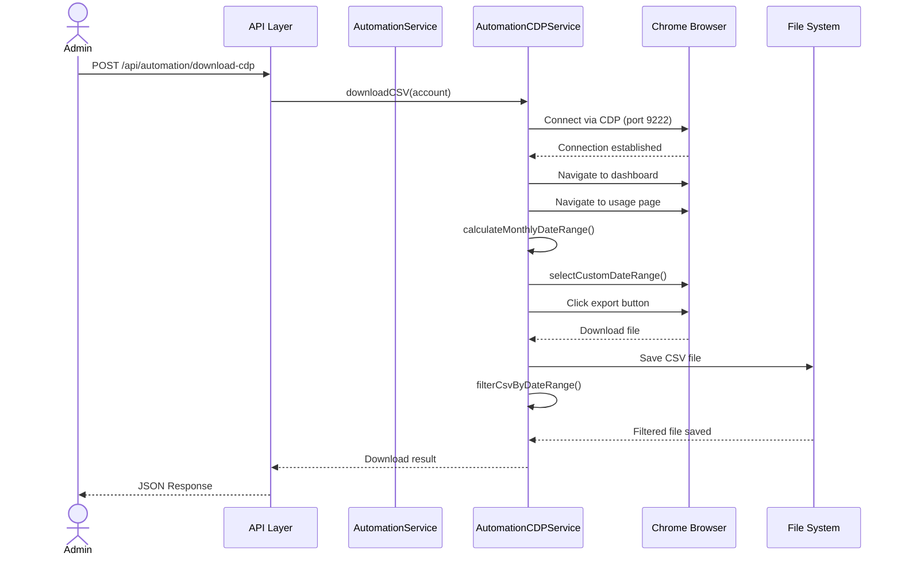

# TDD: CSV Download Automation Enhancement

> **Feature**: CSV Download Automation Enhancement | **Complexity**: Medium
> **Version**: 2.0 | **Updated**: 2026-02-06

---

## 1. Design Overview [REQUIRED]

| Item | Description |
|------|-------------|
| **Purpose** | Enhance existing CSV download automation with monthly filtering, CDP integration, and improved calendar navigation |
| **Actors** | System Admin, Automation Service, Chrome Browser, CDP Service |
| **Key Decisions** | Dual service architecture (Playwright + CDP), shared utility functions, monthly date range filtering |

---

## 2. ERD / Data Model [CONDITIONAL]

> **SKIP**: No database changes - enhancement uses existing Account model

---

## 3. Roles & Permissions [CONDITIONAL]

> **SKIP**: Uses existing authentication system - no new permission changes

---

## 4. API Design [REQUIRED]

### Endpoints Overview

| Method | Endpoint | Purpose | Auth | Roles |
|--------|----------|---------|------|-------|
| POST | `/api/automation/download` | Download CSV (Playwright) | Yes | admin |
| POST | `/api/automation/download-cdp` | Download CSV (CDP) | Yes | admin |
| POST | `/api/automation/run-all` | Batch download all accounts | Yes | admin |
| POST | `/api/automation/run-all-cdp` | Batch download all accounts (CDP) | Yes | admin |

### Request/Response Schema (Enhanced Endpoints)

```json
// POST /api/automation/download-cdp
// Request Body
{
  "accountId": "string (required, UUID)",
  "method": "cdp"
}

// Response 200 Success
{
  "success": true,
  "data": {
    "filePath": "/downloads/user@example.com.csv",
    "fileName": "user@example.com.csv",
    "downloadedAt": "2026-02-06T09:05:00.000Z",
    "originalRecords": 1500,
    "filteredRecords": 450,
    "dateRange": {
      "startDate": "2026-01-01T00:00:00.000Z",
      "endDate": "2026-02-01T00:00:00.000Z"
    }
  }
}

// Response 4xx/5xx Error
{
  "success": false,
  "error": {
    "code": "CDP_CONNECTION_FAILED",
    "message": "Failed to connect to Chrome: Connection refused. Make sure Chrome is running with --remote-debugging-port=9222"
  }
}
```

---

## 5. Architecture & Flow [REQUIRED]

### Sequence Diagram (Enhanced Flow)



---

## 6. Implementation Files [REQUIRED]

| File Path | Action | Description |
|-----------|--------|-------------|
| `src/services/automation.service.js` | MODIFY | Enhanced with monthly filtering and improved calendar navigation |
| `src/services/automation-cdp.service.js` | CREATE | New CDP-based automation service |
| `src/routes/automation.route.js` | MODIFY | Add CDP endpoints |
| `src/controllers/automation.controller.js` | MODIFY | Add CDP controller methods |

---

## 7. Error Handling [CONDITIONAL]

| Code | Scenario | HTTP | User Message |
|------|----------|------|--------------|
| CDP_CONNECTION_FAILED | Chrome CDP not available | 503 | Failed to connect to Chrome. Make sure Chrome is running with --remote-debugging-port=9222 |
| NO_BROWSER_CONTEXT | No Chrome windows open | 503 | No browser context found. Make sure Chrome has at least one window open |
| SESSION_EXPIRED | User session expired during download | 401 | Session expired. Please login in Chrome first |
| EXPORT_BUTTON_NOT_FOUND | Cannot find export button | 404 | Could not find Export CSV button on the page |
| DATE_FILTER_FAILED | CSV filtering failed | 500 | Failed to filter CSV data by date range |

---

## 8. Security & Performance [CONDITIONAL]

### Security

| Aspect | Implementation |
|--------|----------------|
| Authentication | Existing JWT/Session validation |
| Authorization | Admin role required for automation endpoints |
| Input Validation | Account ID validation, file path sanitization |
| CDP Security | Local Chrome connection only (localhost:9222) |

### Performance

| Aspect | Implementation |
|--------|----------------|
| Caching | No caching - real-time data required |
| Database | No additional DB queries |
| File Processing | Stream-based CSV filtering for large files |
| Concurrency | Sequential processing to avoid browser conflicts |

---

## Technical Implementation Details

### [ADDED] Monthly Date Range Calculation

```javascript
function calculateMonthlyDateRange() {
  const now = new Date();
  
  // End date: ngày 1 của tháng hiện tại
  const endDate = new Date(now.getFullYear(), now.getMonth(), 1);
  
  // Start date: ngày 1 của tháng trước
  const startDate = new Date(now.getFullYear(), now.getMonth() - 1, 1);
  
  return {
    startDate,
    endDate,
    startMonth: monthNames[startDate.getMonth()],
    endMonth: monthNames[endDate.getMonth()],
    startYear: startDate.getFullYear(),
    endYear: endDate.getFullYear(),
  };
}
```

### [ADDED] CSV Filtering Logic

```javascript
async function filterCsvByDateRange(filePath, startDate, endDate, id) {
  // Read CSV line by line
  // Parse date from first column: "2026-01-26T01:34:27.572Z"
  // Keep only records where: recordDate >= startDate && recordDate < endDate
  // Write filtered data back to file
  // Return { originalCount, filteredCount }
}
```

### [ADDED] CDP Service Architecture

```javascript
export class AutomationCDPService {
  static async downloadCSV(account) {
    // CHECKPOINT 1: Connect to Chrome via CDP
    // CHECKPOINT 2: Get browser context and page
    // CHECKPOINT 3: Navigate to dashboard
    // CHECKPOINT 4: Verify login status
    // CHECKPOINT 5: Navigate to Usage tab
    // CHECKPOINT 6: Wait for usage page to load
    // CHECKPOINT 7: Select monthly date range
    // CHECKPOINT 8: Find and click Export CSV button
    // CHECKPOINT 9: Wait for download
    // CHECKPOINT 10: Filter CSV by date range
  }
}
```

---

## References

| Type | Path/Link |
|------|-----------|
| FRD | `docs/features/csv-download-automation/FRD-csv-download-automation.md` |
| Test Scenarios | `docs/features/csv-download-automation/TEST-csv-download-automation.md` |
