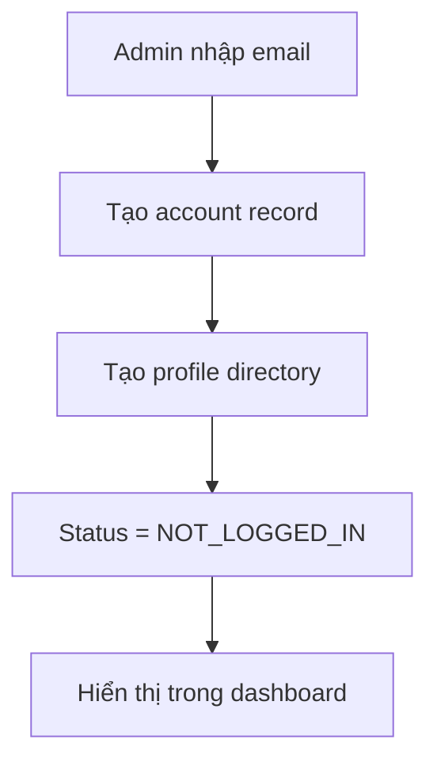
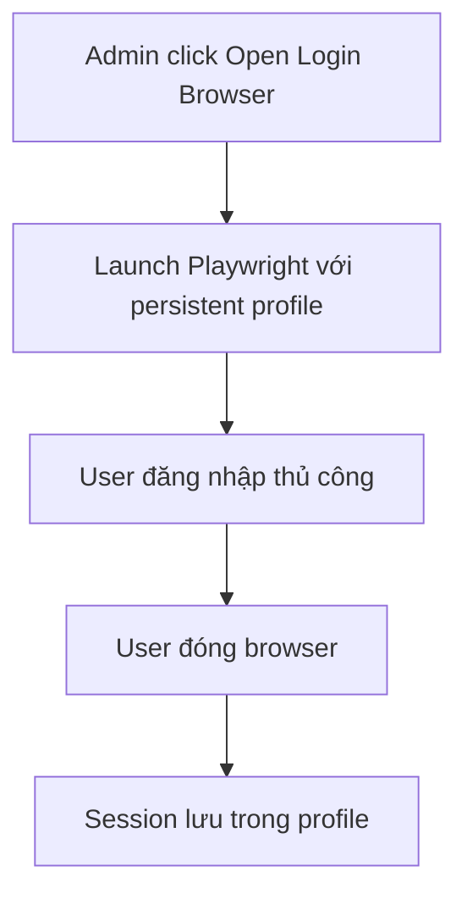
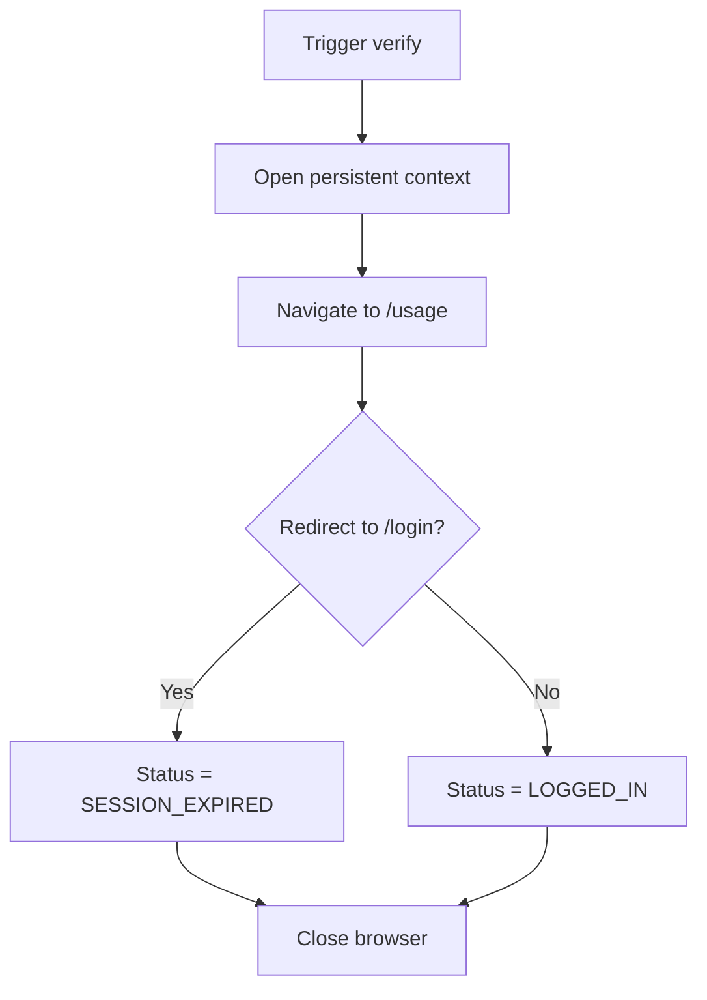
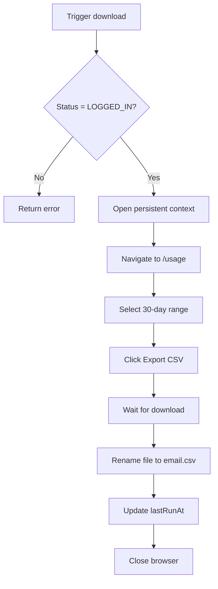

# FRD: Cursor Usage Automation

> **Feature**: Cursor Usage Automation | **Priority**: High | **Status**: Draft
> **Version**: 1.0 | **Updated**: 2026-01-29

---

## 1. Tổng quan (Overview)

| Item | Mô tả |
|------|-------|
| **Mục đích (Purpose)** | Tự động hóa việc tải CSV usage từ Cursor cho nhiều tài khoản, sử dụng persistent browser profile thay vì cookie injection |
| **Phạm vi (Scope)** | Bao gồm: Account management, Login browser, Verification, CSV download, Dashboard UI \| Không bao gồm: Auto login, Cookie injection, Headless login |
| **Người dùng (Users)** | Admin - Quản trị viên quản lý nhiều tài khoản Cursor |
| **Dependencies** | Node.js, Playwright, React |

---

## 2. User Stories

### US-001: Thêm tài khoản mới

**As** admin, **I want** thêm tài khoản Cursor mới, **so that** tôi có thể quản lý nhiều tài khoản.

**Acceptance Criteria**:
- [x] AC-001: Given admin nhập email, when submit, then tạo account với status NOT_LOGGED_IN
- [x] AC-002: Given account được tạo, when success, then tạo thư mục profile rỗng

| Attribute | Value |
|-----------|-------|
| Priority | High |

---

### US-002: Xem danh sách tài khoản

**As** admin, **I want** xem tất cả tài khoản và trạng thái, **so that** tôi có thể theo dõi sức khỏe tài khoản.

**Acceptance Criteria**:
- [x] AC-003: Given có accounts, when load dashboard, then hiển thị list với status, lastRunAt, lastError
- [x] AC-004: Given account có lỗi, when view, then hiển thị error message rõ ràng

| Attribute | Value |
|-----------|-------|
| Priority | High |

---

### US-003: Mở browser để đăng nhập

**As** admin, **I want** mở browser cho tài khoản, **so that** tôi có thể đăng nhập thủ công.

**Acceptance Criteria**:
- [x] AC-005: Given account NOT_LOGGED_IN, when click "Open Login Browser", then mở Chromium với persistent profile
- [x] AC-006: Given browser mở, when user đăng nhập và đóng browser, then session được lưu trong profile

| Attribute | Value |
|-----------|-------|
| Priority | High |

---

### US-004: Xác thực trạng thái đăng nhập

**As** admin, **I want** verify login status, **so that** tôi biết session còn valid không.

**Acceptance Criteria**:
- [x] AC-007: Given account, when verify, then navigate đến /usage và check redirect
- [x] AC-008: Given redirect đến /login, when verify, then status = SESSION_EXPIRED
- [x] AC-009: Given không redirect, when verify, then status = LOGGED_IN

| Attribute | Value |
|-----------|-------|
| Priority | High |

---

### US-005: Tải CSV cho một tài khoản

**As** admin, **I want** tải CSV usage cho một account, **so that** tôi có dữ liệu usage.

**Acceptance Criteria**:
- [x] AC-010: Given account LOGGED_IN, when download, then tải CSV 30-day
- [x] AC-011: Given CSV downloaded, when save, then file đặt tên theo email
- [x] AC-012: Given download success, when complete, then update lastRunAt

| Attribute | Value |
|-----------|-------|
| Priority | High |

---

### US-006: Tải CSV cho tất cả tài khoản

**As** admin, **I want** batch download CSV, **so that** tôi có thể xử lý hàng loạt.

**Acceptance Criteria**:
- [x] AC-013: Given có nhiều LOGGED_IN accounts, when batch run, then download tuần tự
- [x] AC-014: Given một account fail, when continue, then tiếp tục với account tiếp theo

| Attribute | Value |
|-----------|-------|
| Priority | Medium |

---

### US-007: Xóa tài khoản

**As** admin, **I want** xóa tài khoản, **so that** tôi có thể dọn dẹp accounts không dùng.

**Acceptance Criteria**:
- [x] AC-015: Given account, when delete, then xóa khỏi accounts.json
- [x] AC-016: Given delete, when success, then xóa thư mục profile

| Attribute | Value |
|-----------|-------|
| Priority | Medium |

---

## 3. Business Rules

| ID | Rule Name | Description | Exception |
|----|-----------|-------------|-----------|
| BR-001 | One Profile Per Account | Mỗi account có đúng một profile directory | None |
| BR-002 | No Concurrent Profile | Không chạy cùng profile đồng thời | None |
| BR-003 | No Cookie Exposure | Không log/serialize/expose cookies | None |
| BR-004 | Manual Login Only | Không tự động đăng nhập | None |
| BR-005 | No Logout | Không programmatically logout | None |
| BR-006 | Sequential Execution | Chạy tuần tự, không parallel | None |

---

## 4. Non-Functional Requirements

| ID | Category | Requirement | Metric | Priority |
|----|----------|-------------|--------|----------|
| NFR-001 | Performance | Automation execution time | < 2 min/account | Medium |
| NFR-002 | Security | Không expose cookies/localStorage | Zero leakage | High |
| NFR-003 | Reliability | CSV download success rate | ≥ 95% | High |
| NFR-004 | Logging | Backend có structured logging | All operations logged | High |
| NFR-005 | Storage | Profile size | < 500MB/profile | Low |

---

## 5. Process Flow

### 5.1 Add Account Flow

### 5.2 Login Flow

### 5.3 Verify Login Flow

### 5.4 Download CSV Flow

---

## References

| Type | Path/Link |
|------|-----------|
| PRD | `docs/PRD.md` |
| TDD | `docs/features/cursor-usage-automation/TDD-cursor-usage-automation.md` |
| Test Scenarios | `docs/features/cursor-usage-automation/TEST-cursor-usage-automation.md` |
