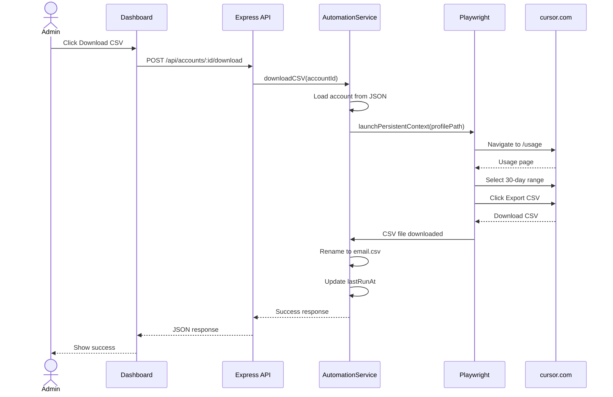
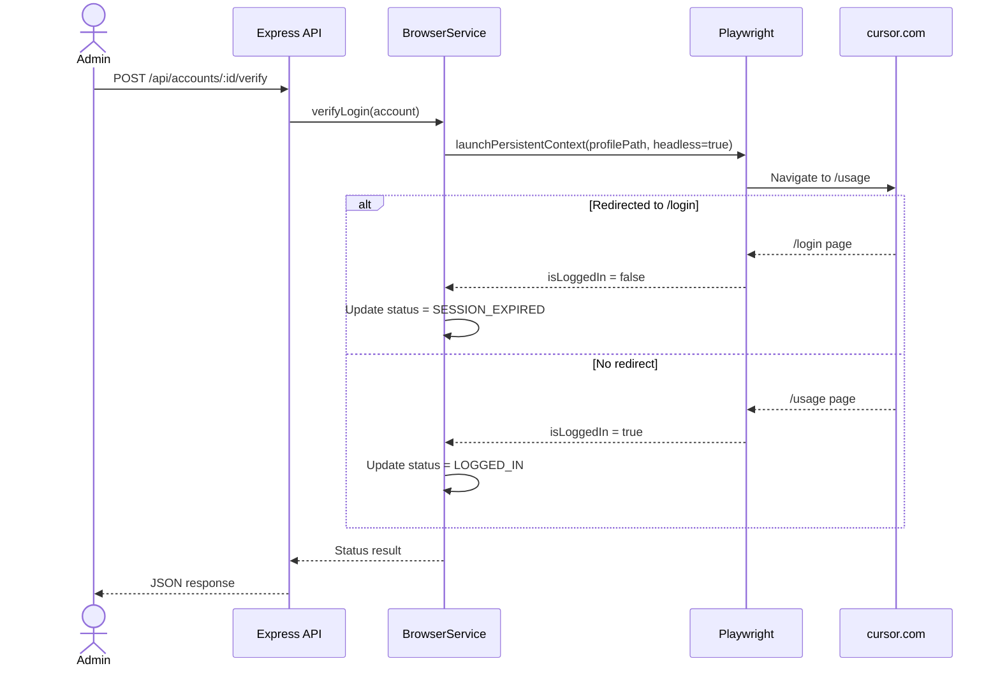

# TDD: Cursor Usage Automation

> **Feature**: Cursor Usage Automation | **Complexity**: Medium
> **Version**: 1.0 | **Updated**: 2026-01-29

## Complexity Guide

| Level | Criteria | Required Sections |
|-------|----------|-------------------|
| **Simple** | Basic CRUD, single entity, no complex logic | 1, 4, 5, 6 |
| **Medium** | Multiple entities, business logic, permissions | 1, 2, 3, 4, 5, 6, 7 |
| **Complex** | Workflows, integrations, security requirements | All (1-8) |

---

## 1. Design Overview

| Item | Description |
|------|-------------|
| **Purpose** | Backend API + Automation service để quản lý accounts và tự động tải CSV từ Cursor Usage |
| **Actors** | Admin (user duy nhất) |
| **Key Decisions** | Persistent browser profile thay vì cookie injection; Winston logger; Sequential execution; File-based data store |

### Tech Stack

| Component | Technology | Reason |
|-----------|------------|--------|
| Runtime | Node.js 18+ | LTS, stable |
| API Framework | Express.js | Simple, well-documented |
| Automation | Playwright | Persistent context support |
| Logging | Winston | Structured logging, file rotation |
| Frontend | React + Vite | Fast dev, modern |
| UI Components | shadcn/ui + TailwindCSS | Beautiful, accessible |
| Data Store | JSON file | Simple, no DB needed |

---

## 2. Data Model

### Account Model (accounts.json)

```json
{
  "accounts": [
    {
      "id": "string (uuid)",
      "email": "string",
      "profilePath": "string (relative path)",
      "status": "NOT_LOGGED_IN | LOGGED_IN | SESSION_EXPIRED",
      "lastRunAt": "ISO8601 datetime | null",
      "lastError": "string | null",
      "createdAt": "ISO8601 datetime",
      "updatedAt": "ISO8601 datetime"
    }
  ]
}
```

### Status Enum

| Status | Description |
|--------|-------------|
| NOT_LOGGED_IN | Account mới tạo, chưa đăng nhập |
| LOGGED_IN | Session valid, có thể automation |
| SESSION_EXPIRED | Session hết hạn, cần re-login |

---

## 3. Roles & Permissions

| Role | Description | Permissions |
|------|-------------|-------------|
| admin | Người dùng duy nhất | All operations |

> **Note**: Không có authentication vì đây là internal tool chạy local.

---

## 4. API Design

### Endpoints Overview

| Method | Endpoint | Purpose | Auth |
|--------|----------|---------|------|
| GET | `/api/accounts` | List all accounts | No |
| POST | `/api/accounts` | Add new account | No |
| GET | `/api/accounts/:id` | Get account details | No |
| DELETE | `/api/accounts/:id` | Delete account | No |
| POST | `/api/accounts/:id/open-browser` | Open login browser | No |
| POST | `/api/accounts/:id/verify` | Verify login status | No |
| POST | `/api/accounts/:id/download` | Download CSV for account | No |
| POST | `/api/automation/run-all` | Download CSV for all LOGGED_IN | No |
| GET | `/api/automation/status` | Get automation status | No |

### Request/Response Schema

#### POST /api/accounts

```json
// Request Body
{
  "email": "string (required, valid email format)"
}

// Response 201 Created
{
  "success": true,
  "data": {
    "id": "uuid",
    "email": "user@example.com",
    "profilePath": "profiles/acc-uuid",
    "status": "NOT_LOGGED_IN",
    "lastRunAt": null,
    "lastError": null,
    "createdAt": "2026-01-29T14:45:00.000Z",
    "updatedAt": "2026-01-29T14:45:00.000Z"
  }
}

// Response 400 Bad Request
{
  "success": false,
  "error": {
    "code": "ERR-ACC-001",
    "message": "Email is required"
  }
}
```

#### GET /api/accounts

```json
// Response 200 OK
{
  "success": true,
  "data": [
    {
      "id": "uuid",
      "email": "user@example.com",
      "status": "LOGGED_IN",
      "lastRunAt": "2026-01-29T14:45:00.000Z",
      "lastError": null
    }
  ]
}
```

#### POST /api/accounts/:id/open-browser

```json
// Response 200 OK
{
  "success": true,
  "message": "Browser opened. Please login manually and close the browser when done."
}

// Response 404 Not Found
{
  "success": false,
  "error": {
    "code": "ERR-ACC-002",
    "message": "Account not found"
  }
}
```

#### POST /api/accounts/:id/verify

```json
// Response 200 OK
{
  "success": true,
  "data": {
    "status": "LOGGED_IN",
    "previousStatus": "NOT_LOGGED_IN"
  }
}
```

#### POST /api/accounts/:id/download

```json
// Response 200 OK
{
  "success": true,
  "data": {
    "filePath": "download/user@example.com.csv",
    "downloadedAt": "2026-01-29T14:45:00.000Z"
  }
}

// Response 400 Bad Request
{
  "success": false,
  "error": {
    "code": "ERR-AUTO-001",
    "message": "Account is not logged in"
  }
}
```

#### POST /api/automation/run-all

```json
// Response 200 OK
{
  "success": true,
  "data": {
    "total": 5,
    "successful": 4,
    "failed": 1,
    "results": [
      { "id": "uuid1", "email": "a@b.com", "success": true },
      { "id": "uuid2", "email": "c@d.com", "success": false, "error": "Session expired" }
    ]
  }
}
```

---

## 5. Architecture & Flow

### System Architecture

```
┌─────────────────────────────────────────────────────────────┐
│                        Frontend (React)                      │
│                    http://localhost:5173                     │
└─────────────────────────┬───────────────────────────────────┘
                          │ HTTP API
┌─────────────────────────▼───────────────────────────────────┐
│                    Backend (Express)                         │
│                    http://localhost:3000                     │
│  ┌─────────────┐  ┌─────────────┐  ┌─────────────────────┐  │
│  │   Routes    │──│  Services   │──│  Playwright Browser │  │
│  └─────────────┘  └─────────────┘  └─────────────────────┘  │
│         │               │                    │               │
│  ┌──────▼───────────────▼────────────────────▼──────────┐   │
│  │                    Logger (Winston)                   │   │
│  └───────────────────────────────────────────────────────┘   │
└─────────────────────────┬───────────────────────────────────┘
                          │
┌─────────────────────────▼───────────────────────────────────┐
│                      File System                             │
│  ┌──────────────┐  ┌──────────────┐  ┌──────────────────┐   │
│  │accounts.json │  │  profiles/   │  │    download/     │   │
│  └──────────────┘  └──────────────┘  └──────────────────┘   │
└─────────────────────────────────────────────────────────────┘
```

### Sequence Diagram: Download CSV



### Sequence Diagram: Verify Login



---

## 6. Implementation Files

| File Path | Action | Description |
|-----------|--------|-------------|
| `.gitignore` | CREATE | Ignore profiles/, download/, node_modules/, logs/ |
| `package.json` | CREATE | Dependencies và scripts |
| `src/config/index.js` | CREATE | Configuration constants |
| `src/utils/logger.js` | CREATE | Winston logger setup |
| `src/models/account.js` | CREATE | Account data model và JSON operations |
| `src/services/account.service.js` | CREATE | Account CRUD operations |
| `src/services/browser.service.js` | CREATE | Playwright browser management |
| `src/services/automation.service.js` | CREATE | CSV download automation |
| `src/routes/account.routes.js` | CREATE | Account API routes |
| `src/routes/automation.routes.js` | CREATE | Automation API routes |
| `src/app.js` | CREATE | Express app setup |
| `src/server.js` | CREATE | Server entry point |
| `accounts.json` | CREATE | Initial empty accounts data |
| `client/` | CREATE | React frontend (separate setup) |

---

## 7. Error Handling

| Code | Scenario | HTTP | User Message |
|------|----------|------|--------------|
| ERR-ACC-001 | Email is required | 400 | Email là bắt buộc |
| ERR-ACC-002 | Account not found | 404 | Không tìm thấy tài khoản |
| ERR-ACC-003 | Email already exists | 409 | Email đã tồn tại |
| ERR-AUTO-001 | Account not logged in | 400 | Tài khoản chưa đăng nhập |
| ERR-AUTO-002 | Session expired | 401 | Phiên đăng nhập đã hết hạn |
| ERR-AUTO-003 | Download failed | 500 | Tải CSV thất bại |
| ERR-AUTO-004 | Browser already open | 409 | Browser đang mở cho tài khoản này |
| ERR-SYS-001 | Internal server error | 500 | Lỗi hệ thống |

---

## 8. Security & Performance

### Security

| Aspect | Implementation |
|--------|----------------|
| Cookie Protection | KHÔNG log, serialize, hoặc expose cookies |
| Profile Isolation | Mỗi account có profile riêng |
| File Security | profiles/ và download/ trong .gitignore |
| No Remote Upload | Profiles KHÔNG được upload lên bất kỳ đâu |

### Performance

| Aspect | Implementation |
|--------|----------------|
| Sequential Execution | Không chạy concurrent cùng profile |
| Browser Reuse | Close browser sau mỗi operation |
| Timeout | 60s timeout cho mỗi operation |
| Logging | Async file logging để không block |

### Logging Strategy

| Level | Usage |
|-------|-------|
| ERROR | Exceptions, failures |
| WARN | Session expired, retries |
| INFO | Operation start/end, status changes |
| DEBUG | Detailed steps, selectors |

---

## Cursor Page Selectors (Configurable)

> **Note**: Selectors có thể thay đổi. Cấu trúc code để dễ update.

```javascript
const SELECTORS = {
  // Usage page
  usagePage: {
    dateRangeDropdown: '[data-testid="date-range-dropdown"]', // TBD
    exportButton: '[data-testid="export-csv"]', // TBD
    last30Days: '[data-testid="last-30-days"]', // TBD
  },
  // Login detection
  loginPage: {
    loginForm: 'form[action*="login"]', // TBD
    emailInput: 'input[type="email"]', // TBD
  }
};
```

---

## References

| Type | Path/Link |
|------|-----------|
| PRD | `docs/PRD.md` |
| FRD | `docs/features/cursor-usage-automation/FRD-cursor-usage-automation.md` |
| Test Scenarios | `docs/features/cursor-usage-automation/TEST-cursor-usage-automation.md` |
