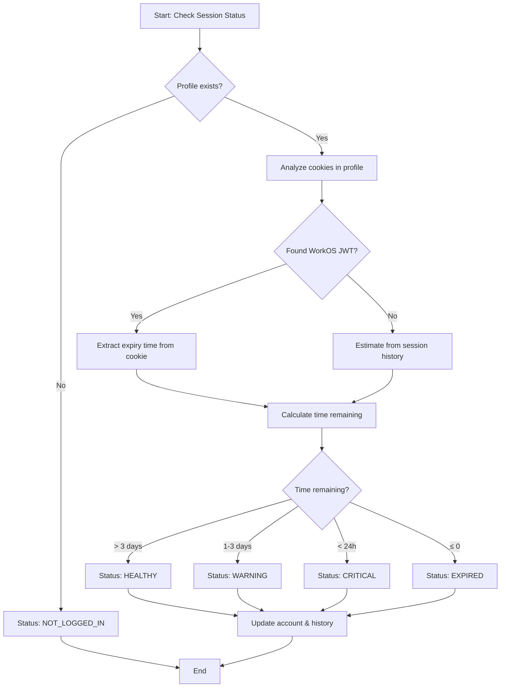
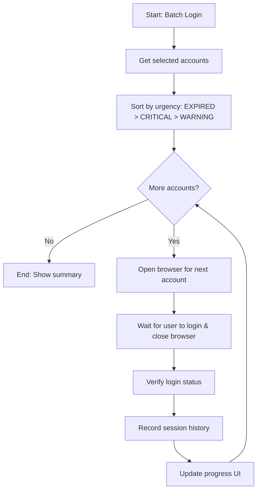

# FRD: Session Expiry Tracking

> **Feature**: Session Expiry Tracking | **Priority**: High | **Status**: Draft
> **Version**: 1.0 | **Updated**: 2026-01-30

---

## 1. Tổng quan (Overview)

| Item                   | Mô tả                                                                                                                                                                             |
| ---------------------- | --------------------------------------------------------------------------------------------------------------------------------------------------------------------------------- |
| **Mục đích (Purpose)** | Theo dõi thời gian session còn hiệu lực của các account Cursor, cảnh báo trước khi hết hạn để admin có thể login tập trung nhiều account cùng lúc, tránh login rải rác nhiều ngày |
| **Phạm vi (Scope)**    | Bao gồm: Phân tích cookie expiry, dự đoán session lifetime, cảnh báo proactive, lịch sử session, batch login workflow \| Không bao gồm: Auto-login, cookie injection              |
| **Người dùng (Users)** | Admin quản lý nhiều tài khoản Cursor                                                                                                                                              |
| **Dependencies**       | Account Management (F-001), Login Browser (F-002), Login Verification (F-003)                                                                                                     |

---

## 2. User Stories

### US-SET-001: Xem trạng thái session của tất cả accounts

**As** admin, **I want** xem trạng thái session của tất cả accounts được nhóm theo mức độ urgency, **so that** tôi biết accounts nào cần login lại sớm.

**Acceptance Criteria**:

- [ ] AC-001: Accounts được nhóm thành 4 trạng thái: HEALTHY (≥3 ngày), WARNING (1-3 ngày), CRITICAL (<24h), EXPIRED
- [ ] AC-002: Mỗi account hiển thị thời gian còn lại ước tính (estimated time remaining)
- [ ] AC-003: Accounts trong nhóm CRITICAL và EXPIRED được highlight rõ ràng

| Attribute | Value |
| --------- | ----- |
| Priority  | High  |

### US-SET-002: Nhận cảnh báo khi session sắp hết hạn

**As** admin, **I want** nhận cảnh báo khi session sắp hết hạn, **so that** tôi có thể chuẩn bị login lại trước khi session thực sự hết.

**Acceptance Criteria**:

- [ ] AC-001: Cảnh báo lần 1 khi session còn ≤3 ngày (WARNING)
- [ ] AC-002: Cảnh báo lần 2 khi session còn <24 giờ (CRITICAL)
- [ ] AC-003: Cảnh báo hiển thị trong dashboard với badge/indicator rõ ràng

| Attribute | Value |
| --------- | ----- |
| Priority  | High  |

### US-SET-003: Xem lịch sử session của account

**As** admin, **I want** xem lịch sử session của từng account, **so that** tôi có thể hiểu pattern và dự đoán khi nào cần login lại.

**Acceptance Criteria**:

- [ ] AC-001: Hiển thị danh sách các lần login và expiry trong quá khứ
- [ ] AC-002: Hiển thị average session duration tính từ lịch sử
- [ ] AC-003: Hiển thị predicted next expiry dựa trên pattern

| Attribute | Value  |
| --------- | ------ |
| Priority  | Medium |

### US-SET-004: Batch login nhiều accounts

**As** admin, **I want** login nhiều accounts cần re-login cùng lúc, **so that** tôi có thể login tập trung 1 lần thay vì login rải rác nhiều ngày.

**Acceptance Criteria**:

- [ ] AC-001: Có thể chọn nhiều accounts cần login
- [ ] AC-002: Mở browser tuần tự (từng cái một) để đảm bảo an toàn
- [ ] AC-003: Hiển thị progress và trạng thái của từng account trong batch

| Attribute | Value |
| --------- | ----- |
| Priority  | High  |

### US-SET-005: Kiểm tra session status theo yêu cầu

**As** admin, **I want** trigger kiểm tra session status khi cần, **so that** tôi có thể cập nhật thông tin mới nhất trước khi quyết định login.

**Acceptance Criteria**:

- [ ] AC-001: Có nút "Check All Sessions" để kiểm tra tất cả accounts
- [ ] AC-002: Có nút "Check Session" cho từng account riêng lẻ
- [ ] AC-003: Hiển thị thời gian kiểm tra lần cuối (lastCheckedAt)

| Attribute | Value |
| --------- | ----- |
| Priority  | High  |

---

## 3. Business Rules

| ID     | Rule Name                     | Description                                                                                      | Exception                                            |
| ------ | ----------------------------- | ------------------------------------------------------------------------------------------------ | ---------------------------------------------------- |
| BR-001 | Session Status Classification | HEALTHY: ≥3 ngày, WARNING: 24h-3 ngày, CRITICAL: <24h, EXPIRED: đã hết hạn hoặc không có session | None                                                 |
| BR-002 | Cookie Expiry Analysis        | Phân tích cookie từ profile để lấy expiry time của WorkOS JWT                                    | Nếu không tìm thấy cookie, dùng estimated từ lịch sử |
| BR-003 | Session Duration Estimation   | Nếu không có cookie expiry, ước tính từ average session duration trong lịch sử                   | Default 7 ngày nếu không có lịch sử                  |
| BR-004 | Batch Login Safety            | Chỉ mở 1 browser tại 1 thời điểm, đợi user đóng browser trước khi mở cái tiếp theo               | None                                                 |
| BR-005 | History Retention             | Lưu tối đa 50 session records per account                                                        | Xóa records cũ nhất khi vượt quá                     |

---

## 4. Non-Functional Requirements

| ID      | Category    | Requirement                           | Metric                             | Priority |
| ------- | ----------- | ------------------------------------- | ---------------------------------- | -------- |
| NFR-001 | Performance | Cookie analysis phải hoàn thành nhanh | < 2s per account                   | High     |
| NFR-002 | Reliability | Session status phải chính xác         | ≥95% accuracy so với thực tế       | High     |
| NFR-003 | Usability   | UI phải rõ ràng, dễ hiểu trạng thái   | User hiểu ngay không cần hướng dẫn | Medium   |

---

## 5. Process Flow

### 5.1 Session Status Check Flow

### 5.2 Batch Login Flow

---

## References

| Type           | Path/Link                                                               |
| -------------- | ----------------------------------------------------------------------- |
| TDD            | `docs/features/session-expiry-tracking/TDD-session-expiry-tracking.md`  |
| Test Scenarios | `docs/features/session-expiry-tracking/TEST-session-expiry-tracking.md` |
