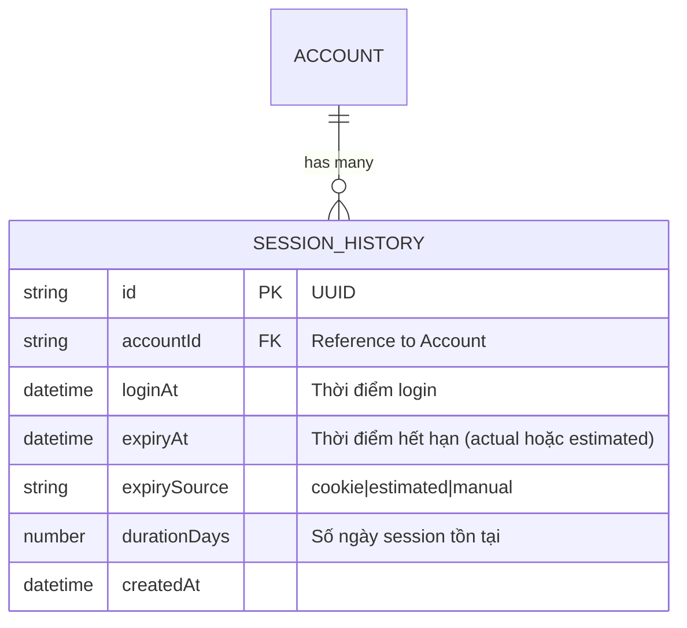
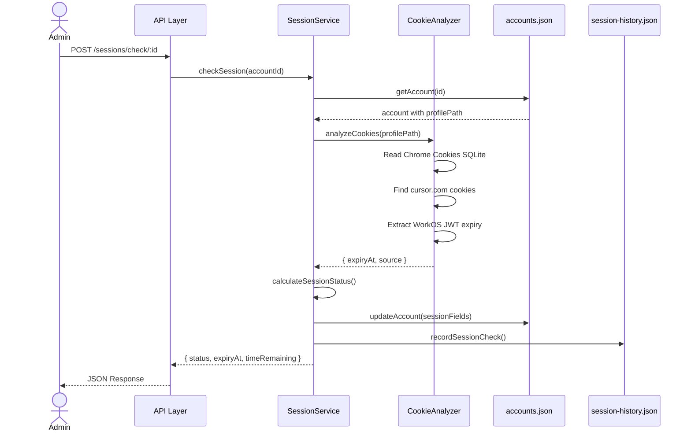
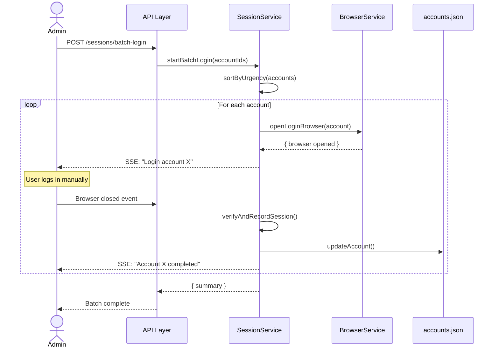

# TDD: Session Expiry Tracking

> **Feature**: Session Expiry Tracking | **Complexity**: Medium
> **Version**: 1.0 | **Updated**: 2026-01-30

---

## 1. Design Overview

| Item | Description |
|------|-------------|
| **Purpose** | Phân tích cookie/profile để theo dõi session expiry, cảnh báo proactive, lưu lịch sử session để dự đoán pattern |
| **Actors** | Admin (quản lý accounts), System (tự động phân tích) |
| **Key Decisions** | Phân tích SQLite cookie database từ Chrome profile; Lưu session history trong JSON file; Tính toán estimated expiry từ lịch sử nếu không có cookie |

---

## 2. ERD / Data Model

### 2.1 Session History Model



### 2.2 Extended Account Model

Thêm các fields vào Account model hiện tại:

| Field | Type | Description |
|-------|------|-------------|
| `sessionExpiryAt` | datetime \| null | Thời điểm session hết hạn (từ cookie hoặc estimated) |
| `sessionExpirySource` | enum | 'cookie' \| 'estimated' \| 'unknown' |
| `sessionStatus` | enum | 'HEALTHY' \| 'WARNING' \| 'CRITICAL' \| 'EXPIRED' \| 'UNKNOWN' |
| `lastSessionCheckAt` | datetime \| null | Lần cuối kiểm tra session |
| `averageSessionDays` | number \| null | Average session duration từ lịch sử |

---

## 3. Session Status Classification

| Status | Condition | Color | Description |
|--------|-----------|-------|-------------|
| HEALTHY | > 3 days remaining | Green | Session còn nhiều thời gian |
| WARNING | 1-3 days remaining | Yellow/Orange | Cảnh báo lần 1 - nên chuẩn bị login |
| CRITICAL | < 72 hours remaining | Red | Cảnh báo lần 2 - cần login sớm |
| EXPIRED | ≤ 0 or session invalid | Dark Red | Đã hết hạn, cần login ngay |
| UNKNOWN | Không có thông tin | Gray | Chưa kiểm tra hoặc không có dữ liệu |

---

## 4. API Design

### Endpoints Overview

| Method | Endpoint | Purpose | Auth | 
|--------|----------|---------|------|
| GET | `/api/sessions/status` | Lấy session status của tất cả accounts | No |
| GET | `/api/sessions/status/:accountId` | Lấy session status của 1 account | No |
| POST | `/api/sessions/check` | Kiểm tra session status của tất cả accounts | No |
| POST | `/api/sessions/check/:accountId` | Kiểm tra session status của 1 account | No |
| GET | `/api/sessions/history/:accountId` | Lấy session history của 1 account | No |
| POST | `/api/sessions/batch-login` | Bắt đầu batch login workflow | No |
| GET | `/api/sessions/summary` | Lấy summary theo nhóm trạng thái | No |

### Request/Response Schema

#### GET /api/sessions/status

```json
// Response 200 OK
{
  "success": true,
  "data": {
    "accounts": [
      {
        "id": "uuid",
        "email": "user@example.com",
        "sessionStatus": "WARNING",
        "sessionExpiryAt": "2026-02-02T10:00:00Z",
        "sessionExpirySource": "cookie",
        "timeRemaining": {
          "days": 2,
          "hours": 18,
          "formatted": "2 ngày 18 giờ"
        },
        "lastSessionCheckAt": "2026-01-30T10:00:00Z",
        "averageSessionDays": 7.5
      }
    ],
    "summary": {
      "total": 10,
      "healthy": 5,
      "warning": 2,
      "critical": 1,
      "expired": 2,
      "unknown": 0
    }
  }
}
```

#### GET /api/sessions/summary

```json
// Response 200 OK
{
  "success": true,
  "data": {
    "groups": {
      "EXPIRED": [
        { "id": "uuid1", "email": "expired@example.com", "timeRemaining": null }
      ],
      "CRITICAL": [
        { "id": "uuid2", "email": "critical@example.com", "timeRemaining": { "hours": 48 } }
      ],
      "WARNING": [
        { "id": "uuid3", "email": "warning@example.com", "timeRemaining": { "days": 2 } }
      ],
      "HEALTHY": [
        { "id": "uuid4", "email": "healthy@example.com", "timeRemaining": { "days": 10 } }
      ],
      "UNKNOWN": []
    },
    "needsAttention": 3,
    "lastCheckedAt": "2026-01-30T10:00:00Z"
  }
}
```

#### POST /api/sessions/check/:accountId

```json
// Response 200 OK
{
  "success": true,
  "data": {
    "accountId": "uuid",
    "previousStatus": "HEALTHY",
    "currentStatus": "WARNING",
    "sessionExpiryAt": "2026-02-02T10:00:00Z",
    "sessionExpirySource": "cookie",
    "checkedAt": "2026-01-30T16:30:00Z"
  }
}
```

#### GET /api/sessions/history/:accountId

```json
// Response 200 OK
{
  "success": true,
  "data": {
    "accountId": "uuid",
    "email": "user@example.com",
    "history": [
      {
        "id": "history-uuid",
        "loginAt": "2026-01-23T10:00:00Z",
        "expiryAt": "2026-01-30T10:00:00Z",
        "expirySource": "cookie",
        "durationDays": 7
      }
    ],
    "statistics": {
      "totalSessions": 5,
      "averageDurationDays": 7.2,
      "minDurationDays": 5,
      "maxDurationDays": 10,
      "predictedNextExpiry": "2026-02-06T10:00:00Z"
    }
  }
}
```

#### POST /api/sessions/batch-login

```json
// Request Body
{
  "accountIds": ["uuid1", "uuid2", "uuid3"]
}

// Response 200 OK
{
  "success": true,
  "data": {
    "batchId": "batch-uuid",
    "totalAccounts": 3,
    "message": "Batch login started. Opening browser for first account."
  }
}
```

---

## 5. Architecture & Flow

### 5.1 Cookie Analysis Flow



### 5.2 Batch Login Flow



---

## 6. Implementation Files

| File Path | Action | Description |
|-----------|--------|-------------|
| `src/models/session-history.js` | CREATE | Session history model và storage |
| `src/services/session.service.js` | CREATE | Session tracking business logic |
| `src/services/cookie-analyzer.service.js` | CREATE | Phân tích cookie từ Chrome profile |
| `src/routes/session.routes.js` | CREATE | API routes cho session tracking |
| `src/models/account.js` | MODIFY | Thêm session-related fields |
| `client/src/components/session-tracking/SessionStatusDashboard.tsx` | CREATE | Dashboard hiển thị session status |
| `client/src/components/session-tracking/SessionHistoryPanel.tsx` | CREATE | Panel hiển thị session history |
| `client/src/components/session-tracking/BatchLoginModal.tsx` | CREATE | Modal cho batch login workflow |
| `client/src/hooks/useSessionStatus.ts` | CREATE | Hook để fetch session data |

---

## 7. Error Handling

| Code | Scenario | HTTP | User Message |
|------|----------|------|--------------|
| ERR-SESSION-001 | Account not found | 404 | Không tìm thấy tài khoản |
| ERR-SESSION-002 | Profile not found | 400 | Profile chưa được tạo, vui lòng login trước |
| ERR-SESSION-003 | Cookie analysis failed | 500 | Không thể phân tích cookie, thử lại sau |
| ERR-SESSION-004 | Browser already open | 409 | Browser đang mở cho tài khoản này |
| ERR-SESSION-005 | Batch login in progress | 409 | Đang có batch login đang chạy |

---

## 8. Cookie Analysis Technical Details

### 8.1 Chrome Cookie Database Location

```
profiles/acc-{id}/Default/Cookies
```

SQLite database với schema:
- `host_key`: Domain của cookie (cursor.com)
- `name`: Tên cookie (WorkOS JWT hoặc session cookie)
- `value`: Giá trị cookie (encrypted trên Windows)
- `expires_utc`: Thời gian hết hạn (WebKit timestamp)

### 8.2 Cookie Patterns to Look For

| Cookie Name Pattern | Description |
|---------------------|-------------|
| `__session` | Session cookie |
| `__clerk_db_jwt` | Clerk JWT token |
| `workos_*` | WorkOS related cookies |
| `cursor_*` | Cursor specific cookies |

### 8.3 Expiry Calculation

```javascript
// WebKit timestamp to JS Date
const webkitEpoch = 11644473600000; // milliseconds
const expiryDate = new Date((expires_utc / 1000) - webkitEpoch);
```

---

## References

| Type | Path/Link |
|------|-----------|
| FRD | `docs/features/session-expiry-tracking/FRD-session-expiry-tracking.md` |
| Test Scenarios | `docs/features/session-expiry-tracking/TEST-session-expiry-tracking.md` |
