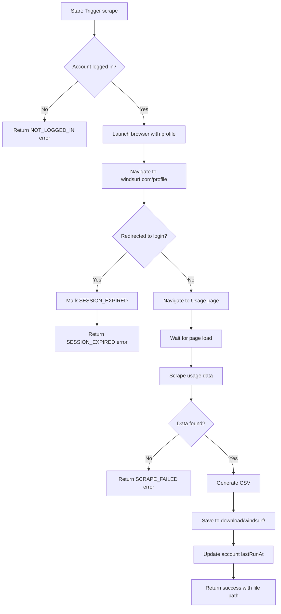

# FRD: Windsurf Usage Scraper

> **Feature**: Windsurf Usage Scraper | **Priority**: High | **Status**: Draft
> **Version**: 1.0 | **Updated**: 2026-02-10

---

## 1. Tổng quan (Overview)

| Item | Mô tả |
|------|-------|
| **Mục đích (Purpose)** | Tự động scrape thông tin usage từ trang Windsurf Profile/Usage để theo dõi credits còn lại, đã sử dụng và ngày reset hàng tháng. Xuất dữ liệu ra file CSV để phân tích và báo cáo. |
| **Phạm vi (Scope)** | Bao gồm: Scrape usage data từ UI Windsurf, xuất CSV, quản lý Windsurf accounts \| Không bao gồm: Download file CSV trực tiếp (Windsurf không hỗ trợ) |
| **Người dùng (Users)** | Admin, System automation |
| **Dependencies** | Playwright browser automation, Account management system hiện tại |

---

## 2. User Stories

### US-001: Scrape Usage Data từ Windsurf

**As** admin, **I want** hệ thống tự động scrape thông tin usage từ trang Windsurf, **so that** tôi có thể theo dõi credits còn lại và đã sử dụng của từng account.

**Acceptance Criteria**:
- [ ] AC-001: Given account đã đăng nhập Windsurf, when chạy scrape, then hệ thống trích xuất được credits remaining
- [ ] AC-002: Given account đã đăng nhập Windsurf, when chạy scrape, then hệ thống trích xuất được credits used
- [ ] AC-003: Given account đã đăng nhập Windsurf, when chạy scrape, then hệ thống trích xuất được ngày reset hàng tháng
- [ ] AC-004: Given scrape thành công, when hoàn tất, then dữ liệu được lưu vào file CSV

| Attribute | Value |
|-----------|-------|
| Priority | High |

---

### US-002: Quản lý Windsurf Accounts

**As** admin, **I want** thêm/xóa/quản lý các Windsurf accounts, **so that** tôi có thể theo dõi nhiều accounts cùng lúc.

**Acceptance Criteria**:
- [ ] AC-001: Given admin, when thêm account mới, then account được lưu với email và profile path
- [ ] AC-002: Given admin, when xem danh sách accounts, then hiển thị tất cả Windsurf accounts với status
- [ ] AC-003: Given admin, when xóa account, then account và profile được xóa

| Attribute | Value |
|-----------|-------|
| Priority | High |

---

### US-003: Tổ chức Download Folder

**As** admin, **I want** folder download được chia riêng cho Cursor và Windsurf, **so that** dễ dàng quản lý và phân biệt dữ liệu.

**Acceptance Criteria**:
- [ ] AC-001: Given download folder, when lưu file Cursor, then file được lưu vào `download/cursor/`
- [ ] AC-002: Given download folder, when lưu file Windsurf, then file được lưu vào `download/windsurf/`

| Attribute | Value |
|-----------|-------|
| Priority | Medium |

---

## 3. Business Rules

| ID | Rule Name | Description | Exception |
|----|-----------|-------------|-----------|
| BR-001 | Login Required | Account phải ở trạng thái LOGGED_IN mới có thể scrape | Trả về lỗi NOT_LOGGED_IN |
| BR-002 | Session Validation | Nếu bị redirect về trang login, đánh dấu SESSION_EXPIRED | None |
| BR-003 | CSV Format | File CSV phải có header và format chuẩn | None |
| BR-004 | Unique Email | Mỗi email chỉ được đăng ký 1 lần trong hệ thống | Trả về lỗi EMAIL_EXISTS |

---

## 4. Non-Functional Requirements

| ID | Category | Requirement | Metric | Priority |
|----|----------|-------------|--------|----------|
| NFR-001 | Performance | Scrape 1 account hoàn tất trong thời gian hợp lý | < 30s per account | Medium |
| NFR-002 | Reliability | Retry logic khi gặp lỗi network | Max 3 retries | Medium |
| NFR-003 | Data Accuracy | Dữ liệu scrape phải chính xác với UI | 100% match | High |

---

## 5. Process Flow



---

## 6. Data Structure

### Windsurf Usage Data (Scraped)

| Field | Type | Description | Example |
|-------|------|-------------|---------|
| email | string | Account email | user@example.com |
| creditsRemaining | number | Credits còn lại | 450 |
| creditsUsed | number | Credits đã sử dụng | 50 |
| creditsTotal | number | Tổng credits | 500 |
| resetDate | string | Ngày reset hàng tháng | 2026-03-01 |
| scrapedAt | datetime | Thời điểm scrape | 2026-02-10T09:55:00Z |

### CSV Output Format

```csv
email,credits_remaining,credits_used,credits_total,reset_date,scraped_at
user@example.com,450,50,500,2026-03-01,2026-02-10T09:55:00Z
```

---

## References

| Type | Path/Link |
|------|-----------|
| TDD | `docs/features/windsurf-usage-scraper/TDD-windsurf-usage-scraper.md` |
| Test Scenarios | `docs/features/windsurf-usage-scraper/TEST-windsurf-usage-scraper.md` |
