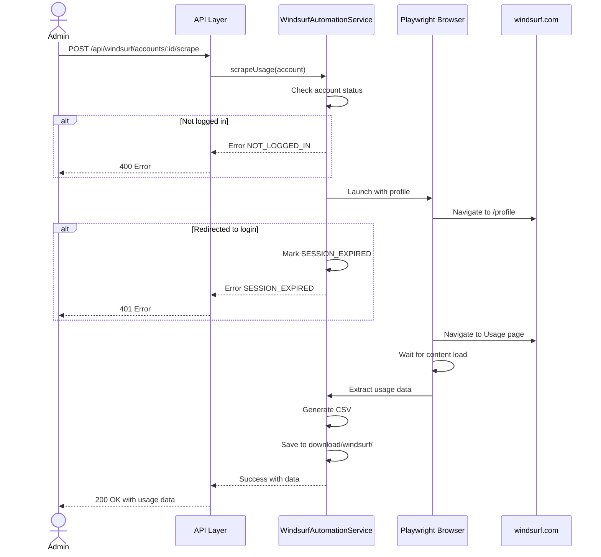

# TDD: Windsurf Usage Scraper

> **Feature**: Windsurf Usage Scraper | **Complexity**: Medium
> **Version**: 1.0 | **Updated**: 2026-02-10

---

## 1. Design Overview

| Item | Description |
|------|-------------|
| **Purpose** | Implement automation service để scrape usage data từ Windsurf UI và xuất ra CSV |
| **Actors** | Admin, System automation |
| **Key Decisions** | Sử dụng Playwright với persistent context, tách riêng windsurf account model, chia folder download theo platform |

---

## 2. Data Model

### Windsurf Account (Mở rộng từ Account Model)

```javascript
// Sử dụng chung AccountModel với thêm field để phân biệt platform
{
  id: "uuid",
  email: "string",
  profilePath: "string",           // profiles/windsurf/acc-{id}
  platform: "windsurf",            // NEW: "cursor" | "windsurf"
  status: "NOT_LOGGED_IN",         // NOT_LOGGED_IN | LOGGED_IN | SESSION_EXPIRED
  lastRunAt: "datetime | null",
  lastError: "string | null",
  lastLoginAt: "datetime | null",
  createdAt: "datetime",
  updatedAt: "datetime"
}
```

### Windsurf Usage Data (Scraped)

```javascript
{
  email: "string",
  creditsRemaining: "number",
  creditsUsed: "number", 
  creditsTotal: "number",
  resetDate: "string",             // YYYY-MM-DD format
  scrapedAt: "datetime"
}
```

---

## 3. Roles & Permissions

| Role | Description | Permissions |
|------|-------------|-------------|
| admin | System administrator | All operations |
| system | Automation process | Scrape, generate CSV |

---

## 4. API Design

### Endpoints Overview

| Method | Endpoint | Purpose | Auth | Roles |
|--------|----------|---------|------|-------|
| GET | `/api/windsurf/accounts` | List all Windsurf accounts | No | admin |
| POST | `/api/windsurf/accounts` | Create Windsurf account | No | admin |
| DELETE | `/api/windsurf/accounts/:id` | Delete account | No | admin |
| POST | `/api/windsurf/accounts/:id/login` | Open browser for login | No | admin |
| POST | `/api/windsurf/accounts/:id/verify` | Verify login status | No | admin |
| POST | `/api/windsurf/accounts/:id/scrape` | Scrape usage data | No | admin |
| POST | `/api/windsurf/scrape-all` | Scrape all logged-in accounts | No | admin |

### Request/Response Schema

```json
// POST /api/windsurf/accounts
// Request Body
{
  "email": "string (required)"
}

// Response 201 Created
{
  "success": true,
  "data": {
    "id": "uuid",
    "email": "user@example.com",
    "platform": "windsurf",
    "status": "NOT_LOGGED_IN",
    "createdAt": "2026-02-10T09:55:00Z"
  }
}

// POST /api/windsurf/accounts/:id/scrape
// Response 200 OK
{
  "success": true,
  "data": {
    "email": "user@example.com",
    "creditsRemaining": 450,
    "creditsUsed": 50,
    "creditsTotal": 500,
    "resetDate": "2026-03-01",
    "scrapedAt": "2026-02-10T09:55:00Z",
    "filePath": "download/windsurf/user@example.com.csv"
  }
}

// Response 4xx/5xx Error
{
  "success": false,
  "error": {
    "code": "ERR-WS-001",
    "message": "Human readable message"
  }
}
```

---

## 5. Architecture & Flow

### Sequence Diagram (Scrape Flow)



---

## 6. Implementation Files

| File Path | Action | Description |
|-----------|--------|-------------|
| `src/config/index.js` | MODIFY | Thêm windsurf URLs, selectors, download paths |
| `src/models/windsurf-account.js` | CREATE | Windsurf account model |
| `src/services/windsurf-automation.service.js` | CREATE | Scrape usage từ UI |
| `src/services/windsurf-browser.service.js` | CREATE | Browser management cho Windsurf |
| `src/routes/windsurf.routes.js` | CREATE | API routes cho Windsurf |
| `src/app.js` | MODIFY | Register windsurf routes |

---

## 7. Error Handling

| Code | Scenario | HTTP | User Message |
|------|----------|------|--------------|
| ERR-WS-001 | Account not found | 404 | Windsurf account not found |
| ERR-WS-002 | Not logged in | 400 | Account is not logged in |
| ERR-WS-003 | Session expired | 401 | Session has expired, please re-login |
| ERR-WS-004 | Scrape failed | 500 | Failed to scrape usage data |
| ERR-WS-005 | Email exists | 409 | Email already registered |
| ERR-WS-006 | Browser in use | 409 | Browser is currently open for this account |

---

## 8. Selectors (Windsurf UI)

> **Note**: Selectors cần được verify trên trang thực tế và có thể cần điều chỉnh

```javascript
windsurf: {
  baseUrl: 'https://windsurf.com',
  profileUrl: 'https://windsurf.com/profile',
  usageUrl: 'https://windsurf.com/profile/usage',  // hoặc path tương tự
  
  selectors: {
    // Usage page selectors - cần verify trên UI thực tế
    creditsRemaining: '[data-testid="credits-remaining"], .credits-remaining, .usage-remaining',
    creditsUsed: '[data-testid="credits-used"], .credits-used, .usage-used',
    creditsTotal: '[data-testid="credits-total"], .credits-total, .usage-total',
    resetDate: '[data-testid="reset-date"], .reset-date, .billing-date',
    usageSection: '.usage-section, [data-testid="usage"], .billing-info',
  }
}
```

---

## 9. CSV Generation

### Output Format

```csv
email,credits_remaining,credits_used,credits_total,reset_date,scraped_at
user@example.com,450,50,500,2026-03-01,2026-02-10T09:55:00.000Z
```

### File Naming

- Single account: `download/windsurf/{email}.csv`
- All accounts: `download/windsurf/all-accounts-{YYYY-MM-DD}.csv`

---

## 10. Folder Structure Update

```
download/
├── cursor/           # CSV files từ Cursor
│   ├── user1@example.com.csv
│   └── user2@example.com.csv
└── windsurf/         # CSV files từ Windsurf
    ├── user1@example.com.csv
    └── all-accounts-2026-02-10.csv
```

---

## References

| Type | Path/Link |
|------|-----------|
| FRD | `docs/features/windsurf-usage-scraper/FRD-windsurf-usage-scraper.md` |
| Test Scenarios | `docs/features/windsurf-usage-scraper/TEST-windsurf-usage-scraper.md` |
